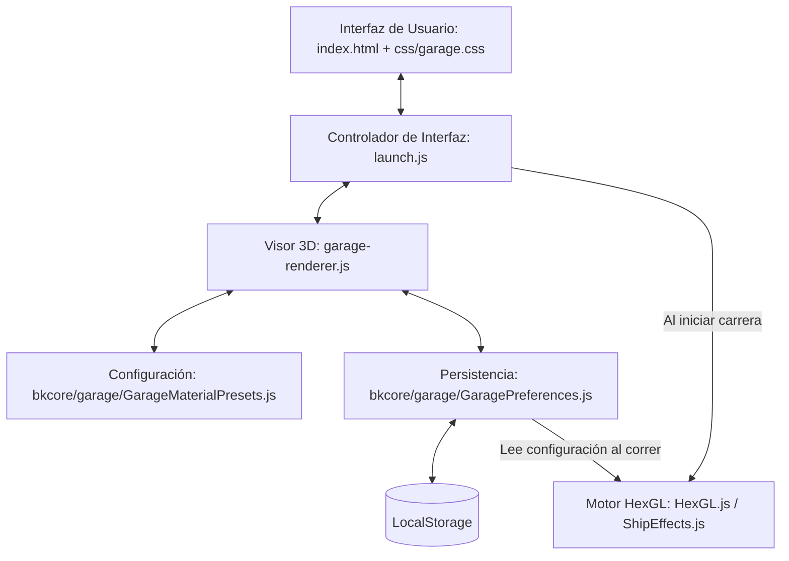
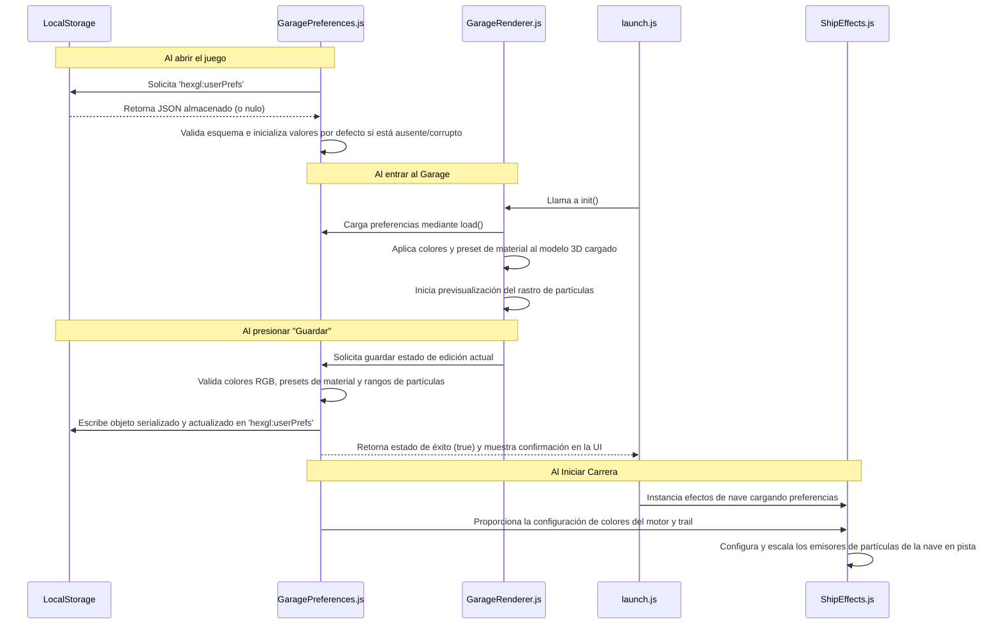

# Documentación del Sistema de Garage — HexGL Customs

Este documento detalla la arquitectura, las características, la persistencia y la estrategia de pruebas del **Sistema de Garage** (Garage Management System) incorporado en **HexGL Customs**.

---

## 1. Arquitectura del Sistema

El sistema está diseñado bajo un enfoque modular desacoplado que interactúa con la biblioteca gráfica **Three.js (versión r53)** y el motor principal de carrera de HexGL. A continuación se presenta un **diagrama simplificado** de la interacción de los componentes core de personalización (existe un diagrama arquitectónico más completo disponible por separado):



### Componentes de Software (Ficheros Core)

1. **[garage-renderer.js](garage-renderer.js)**
   * **Responsabilidad:** Gestiona la escena 3D en tiempo real del garage.
   * **Funcionalidades:**
     * Inicialización del renderizador WebGL, cámara de perspectiva y luces dramáticas (Key, Fill, Rim, y Point Lights).
     * Carga asíncrona del modelo 3D de la nave (*Feisar*) y aplicación de texturas originales (Difusa, Especular, Normales y mapa cúbico de reflejos).
     * Integración de `THREE.OrbitControls` para permitir rotación manual mediante click/arrastrar y zoom con la rueda del ratón.
     * Renderizado continuo y ciclo de animación (`requestAnimationFrame`), incluyendo animaciones dinámicas complejas para presets como el holográfico.
     * Gestión del ciclo de vida (`destroy`), liberando elementos del DOM, deteniendo bucles y eliminando listeners de eventos para evitar fugas de memoria.

2. **[bkcore/garage/GaragePreferences.js](bkcore/garage/GaragePreferences.js)**
   * **Responsabilidad:** Maneja la validación de esquemas y persistencia local de la personalización de la nave.
   * **Funcionalidades:**
     * Interfaz de persistencia sobre `window.localStorage` con claves versionadas (`hexgl:userPrefs`).
     * Esquema de datos fuertemente validado con expresiones regulares para colores hexadecimales (`^#[0-9a-f]{6}$`), validación de presets de material autorizados y rangos numéricos para el tamaño del trail de partículas (`0.5` a `4.0`).
     * Compatibilidad garantizada hacia atrás con versiones antiguas del esquema (conversión automática de atributos heredados como `ship.trail`).
     * Control de estados de fallback (valores por defecto) cuando se ingresan datos corruptos o incompletos.

3. **[bkcore/garage/GarageMaterialPresets.js](bkcore/garage/GarageMaterialPresets.js)**
   * **Responsabilidad:** Centraliza los coeficientes físicos y visuales de los materiales aplicables a la carrocería de la nave.
   * **Funcionalidades:**
     * Define los coeficientes de brillo (`shininess`), brillo especular (`specular`), reflectividad (`reflectivity`), color ambiental (`ambientColor`) y factor de atenuación difusa (`diffuseMultiplier`) para cada uno de los 4 acabados preestablecidos.
     * Provee adaptabilidad dinámica para modificar las propiedades en caliente sobre instancias de `THREE.ShaderMaterial` (el shader personalizado de HexGL) o de `THREE.MeshPhongMaterial` (fallback estándar).

4. **[bkcore/hexgl/ShipEffects.js](bkcore/hexgl/ShipEffects.js)**
   * **Responsabilidad:** Integra las preferencias personalizadas del usuario dentro de la simulación de carrera activa.
   * **Funcionalidades:**
     * Carga el estado actual de personalización al instanciar la nave en pista.
     * Ajusta dinámicamente los parámetros cromáticos y de escala de las partículas emitidas en la estela izquierda y derecha (`leftEngineTrail` y `rightEngineTrail`), nubes de colisión (`leftClouds` / `rightClouds`) y chispas (`leftSparks` / `rightSparks`).

5. **[launch.js](launch.js)**
   * **Responsabilidad:** Coordina los flujos de pantalla del juego y actúa como mediador de eventos DOM.
   * **Funcionalidades:**
     * Captura transiciones del menú principal al visor del garage y viceversa.
     * Enlaza eventos de selección en las paletas de colores del panel de control con el renderizador del garage en tiempo real.
     * Dispara avisos visuales (toast notifications) al guardar configuraciones y maneja la inicialización segura del viewport evitando solapamientos gráficos.

6. **[css/garage.css](css/garage.css)**
   * **Responsabilidad:** Estilo visual y responsivo de la interfaz del garage.
   * **Funcionalidades:**
     * Panel lateral deslizable con diseño moderno translúcido (efecto Glassmorphism).
     * Cuadrículas adaptativas para las paletas de color de la carrocería, motor y estela.
     * Animaciones de hover y estados activos para botones de presets y colores.

---

## 2. Características del Sistema (Features)

El garage expande el juego original agregando una dimensión completa de personalización y control visual:

### 2.1 Visor 3D Interactivo
* **Interacción Natural:** El jugador puede arrastrar el ratón para rotar el modelo de la nave 360° en cualquier eje, permitiendo examinar los acabados desde cualquier perspectiva.
* **Control de Zoom:** Soporte para acercar o alejar la cámara de forma fluida mediante scroll.
* **Base de Exhibición:** La nave flota en el centro de una plataforma circular iluminada de aspecto tecnológico futurista, con anillos emisores de luz neon azul que enmarcan la composición.
* **Iluminación Cinemática:** Diseñada con 3 focos de luz principales (Key, Fill y Rim) más un punto de luz interior (`PointLight`) bajo la nave que proyecta la incandescencia del motor contra la plataforma base en tiempo real.

### 2.2 Personalización de Carrocería
* **Paleta Selectiva:** Dispone de 12 colores prediseñados enfocados en temáticas futuristas (Rojo Racing, Naranja Fuego, Amarillo Eléctrico, Verde Neón, Cyan Turbo, Azul Cobalto, Púrpura Cosmos, Rosa Sakura, Plata Cromado, Negro Stealth, Dorado, y el Blanco original).
* **Entrada Libre (Custom Color):** Permite especificar cualquier color exacto mediante un selector hexadecimal RGB nativo de HTML5.
* **Actualización en Caliente:** El color se inyecta directamente en las variables de shader (`uDiffuseColor`) de Three.js sin requerir recargar la geometría o el material de la escena, proporcionando una previsualización fluida de 60 FPS.

### 2.3 Resplandor de Propulsores (Engine Glow)
* **Punto de Luz Dinámico:** Modifica el resplandor emitido desde las toberas de escape traseras.
* **Retroalimentación Base:** El color seleccionado altera la iluminación de luz puntual del motor sobre la plataforma del garage de inmediato, y se asocia al propulsor principal al iniciar la carrera.

### 2.4 Acabados Avanzados de Material (Material Presets)

El garage ofrece 4 presets con formulaciones físicas únicas que alteran cómo interactúa la luz ambiental y direccional con la superficie:

| Acabado | Características Técnicas de Iluminación | Descripción Estética |
| :--- | :--- | :--- |
| **Metálico** | `shininess: 42`, `reflectivity: 0.9`, reflectancia especular brillante plateada. | Aspecto original de aleación de titanio pulido y reflectante. |
| **Mate** | `shininess: 8`, `reflectivity: 0.12`, reflectancia especular gris oscura. | Superficie opaca de baja reflexión, estilo deportivo moderno. |
| **Holográfico** | `shininess: 120`, `reflectivity: 1.0`, reflectancia especular cyan con ciclo dinámico de color. | Efecto iridiscente animado en tiempo real que varía el tono cromático continuamente. |
| **Sigilo** | `shininess: 1`, `reflectivity: 0.02`, `diffuseMultiplier: 0.13` (absorbe el 87% de la luz). | Superficie absorbente oscura de aspecto táctico y sigiloso. |

> **Mecánica del Acabado Holográfico:**
> Cuando este preset está activo, el ciclo de renderizado calcula frame a frame la conversión HSL-a-Hex para variar gradualmente la luz especular, ambiental y el tinte de difusión base utilizando un pulso sinusoidal de onda continua. Esto crea un reflejo arcoíris dinámico y fluido sobre la nave.

### 2.5 Configuración e Previsualización del Rastro de Partículas (Trail)
* **Rastro de Fuga:** Permite personalizar el tono y tamaño de la estela de humo/plasma que expulsa la nave.
* **Previsualización en Escena:** Dos emisores de partículas de bkcore (`bkcore.threejs.Particles`) se inicializan a la izquierda y derecha en la parte posterior de la nave dentro del garage. Estos emiten ráfagas suaves para que el usuario aprecie el color y tamaño exacto del rastro antes de salir a la pista.
* **Escala de Intensidad:** Un control deslizante (`Range Input`) permite escalar el tamaño de la partícula de `0.5` a `4.0`, actualizando la previsualización del rastro de forma instantánea.

---

## 3. Flujo de Datos y Persistencia

### Modelo del Esquema de Configuración (JSON)

Las preferencias de personalización se guardan bajo el siguiente esquema JSON en `localStorage`:

```json
{
  "schemaVersion": 1,
  "lastUpdated": "2026-05-31T16:20:00.000Z",
  "ship": {
    "colors": {
      "body": "#ffffff",
      "engine": "#00a2ff",
      "trail": "#ffffff"
    },
    "material": {
      "preset": "metallic"
    },
    "particles": {
      "size": 2.0
    }
  }
}
```

### Ciclo de Carga e Integración de Datos



---

## 4. Estrategia de Verificación y Plan de Pruebas

El sistema está respaldado por una sólida suite de pruebas unitarias, de integración, rendimiento y pruebas extremo a extremo (E2E) usando **Jest** y **Playwright**.

### 4.1 Pruebas Unitarias (Unit Tests)
Ejecutadas con **Jest** en [tests/unit/garage-preferences.test.js](tests/unit/garage-preferences.test.js):
* **Inicialización limpia:** Asegura que si `localStorage` está vacío, se devuelven los valores predeterminados canónicos de fábrica.
* **Robustez ante corrupción:** Inserta esquemas dañados o valores no válidos (por ejemplo, colores mal formateados como `#fff` o `red`, presets de material no autorizados, o tamaños de partícula fuera de rango) y valida que el parser recupere y normalice los valores a su versión por defecto de forma segura.
* **Limpieza de almacenamiento:** Valida que el método `clear()` elimine los datos almacenados correctamente.

### 4.2 Pruebas Extremo a Extremo (E2E Playwright)
Ejecutadas sobre una instancia real del navegador en el directorio [tests/garage/](tests/garage/):

1. **[init-teardown.spec.js](tests/garage/init-teardown.spec.js)**:
   * Verifica la correcta inicialización del renderizador WebGL en el DOM al ingresar al garage.
   * Confirma que los listeners de eventos se remueven de manera segura al salir al menú principal para prevenir fugas de memoria.

2. **[ship-load.spec.js](tests/garage/ship-load.spec.js)**:
   * Confirma que el cargador asincrónico `THREE.JSONLoader` localice y cargue la nave *Feisar* exitosamente.
   * Valida la correcta vinculación del mesh 3D en la jerarquía de la escena Three.js.

3. **[preferences.spec.js](tests/garage/preferences.spec.js)**:
   * Interactúa con los controles HTML de la barra lateral (swatches de color, selector personalizado, botones de preset y sliders de tamaño).
   * Comprueba que los cambios estéticos modifiquen el estado interno en vivo del renderizador 3D.
   * Asegura que presionar "Guardar" impacte la clave de almacenamiento del navegador de forma persistente.

4. **[resize.spec.js](tests/garage/resize.spec.js)**:
   * Dispara cambios aleatorios y extremos en la dimensión de la ventana del navegador.
   * Valida que el viewport del garage reajuste su aspect-ratio de cámara y dimensiones físicas del renderizador dinámicamente sin distorsiones gráficas.

5. **[integration.spec.js](tests/garage/integration.spec.js)**:
   * Ejecuta el flujo integral completo de experiencia de usuario:
     1. Abre el garage.
     2. Modifica el color del chasis, motor y trail a valores específicos.
     3. Presiona el botón de guardar.
     4. Vuelve al menú y arranca la carrera en pista.
     5. Lee el estado en tiempo real del mesh y emisores en la escena del juego activo para constatar que coincidan exactamente con la personalización guardada en el garage.

### 4.3 Pruebas de Rendimiento (Performance)
Mapeado en [tests/performance/garage-perf.spec.js](tests/performance/garage-perf.spec.js):
* **Rendimiento de FPS:** Monitorea que la ejecución continua de los shaders, efectos de partículas en el garage y animaciones holográficas se mantengan a una tasa estable ideal de 60 fotogramas por segundo (incluso con la estela a tamaño máximo).
* **Consumo de Memoria:** Garantiza la inexistencia de incrementos acumulativos en el conteo de objetos de geometría o materiales al entrar y salir del garage repetidamente.
