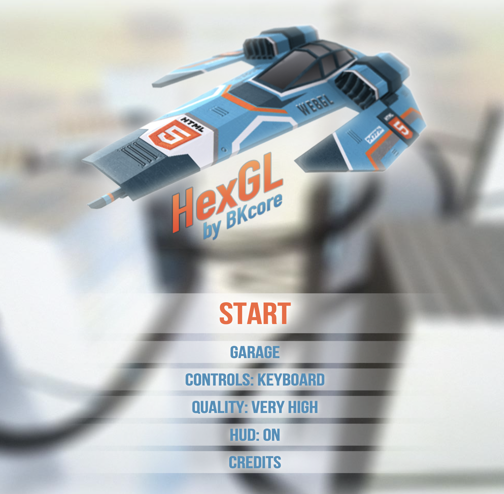
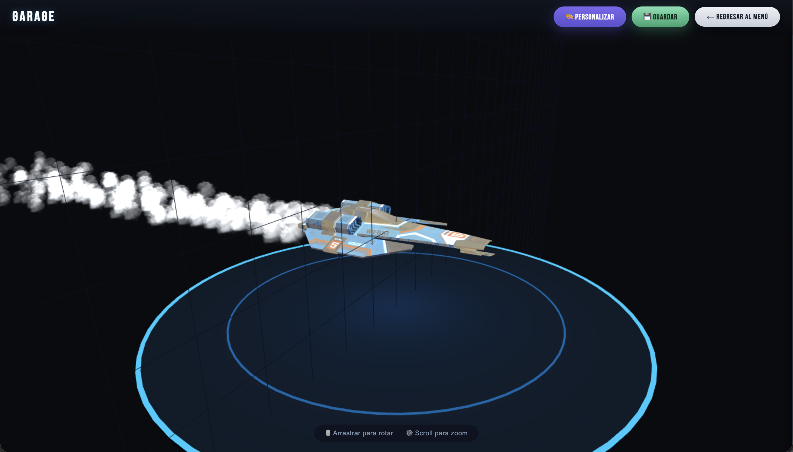
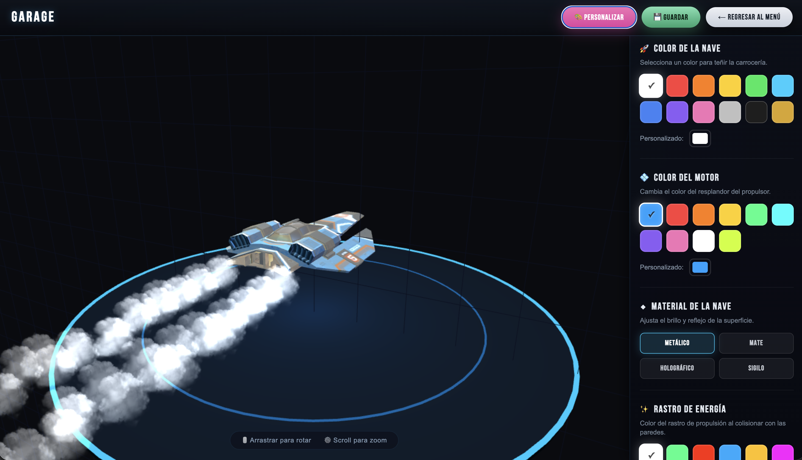
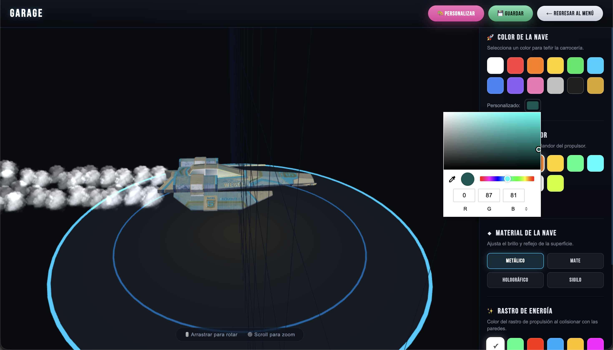
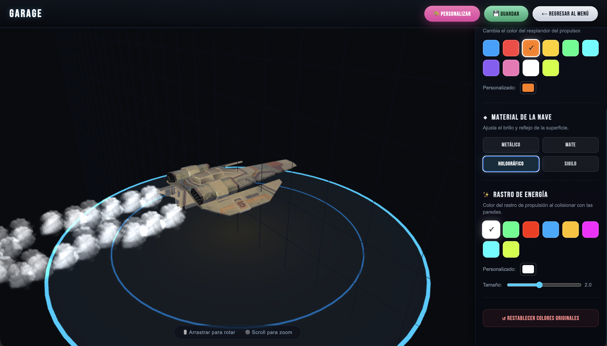
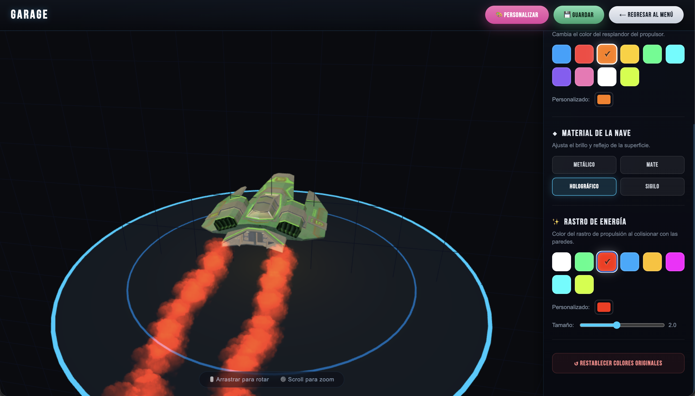
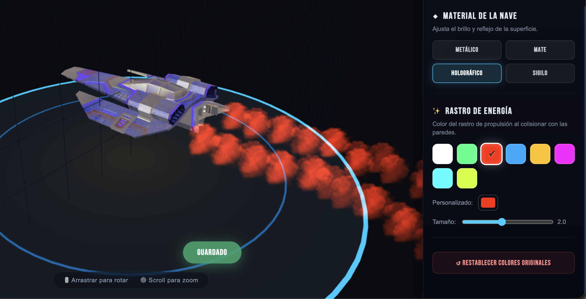
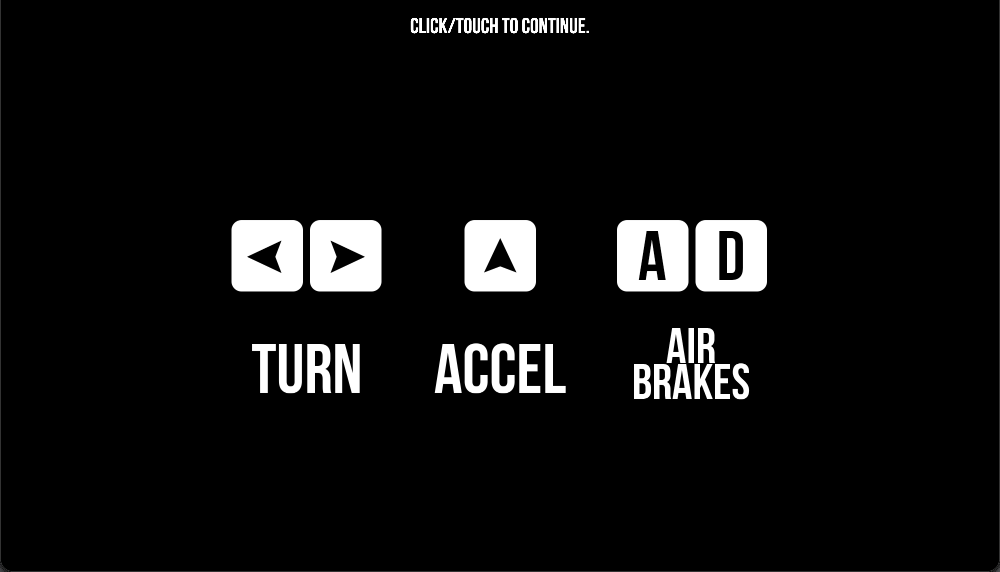
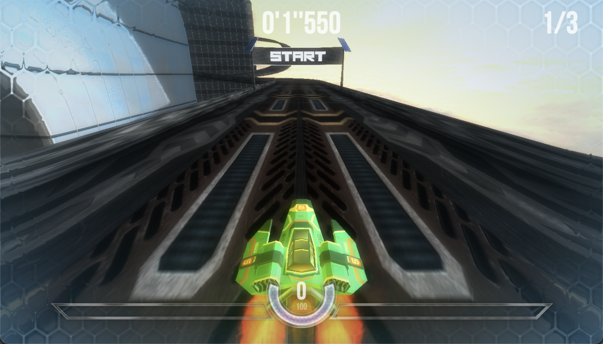

# Manual de Usuario — HexGL Customs

**Versión:** 1.0  
**Equipo:** Equipo Pepsiman  
**Fecha:** Mayo 2026

---

## Tabla de Contenidos

1. [¿Qué es HexGL Customs?](#1-qué-es-hexgl-customs)
2. [Requisitos para jugar](#2-requisitos-para-jugar)
3. [Cómo acceder al juego](#3-cómo-acceder-al-juego)
4. [Pantalla de inicio](#4-pantalla-de-inicio)
5. [El Garage — Personaliza tu nave](#5-el-garage--personaliza-tu-nave)
6. [Cómo jugar](#6-cómo-jugar)
7. [Opciones de configuración](#7-opciones-de-configuración)
8. [Preguntas frecuentes](#8-preguntas-frecuentes)

---

## 1. ¿Qué es HexGL Customs?

HexGL Customs es un juego de carreras futurista en 3D que corre directamente en tu navegador usando WebGL. Controlas una nave de alta velocidad a través de pistas en el espacio. La versión **Customs** añade el sistema **Garage**, donde puedes personalizar el aspecto de tu nave antes de cada carrera: color de carrocería, motor, estela de partículas y material de la superficie.

---

## 2. Requisitos para jugar

No necesitas instalar nada. Solo necesitas:

| Requisito | Detalle |
|-----------|---------|
| **Navegador** | Google Chrome (recomendado), Firefox, Edge o Safari modernos |
| **WebGL** | Activado por defecto en todos los navegadores modernos |
| **Teclado** | Para controlar la nave durante la carrera |
| **Conexión a internet** | Solo para la primera carga; sin descarga adicional |

> **¿No sabes si tu navegador soporta WebGL?**  
> El juego te lo dirá automáticamente al entrar. Si ves un mensaje de error, actualiza tu navegador.

---

## 3. Cómo acceder al juego

Abre tu navegador y entra a la URL del juego (la que te proporcionó el equipo o que está publicada en Vercel).

---

## 4. Pantalla de inicio

Al cargar el juego verás el menú principal con las siguientes opciones:

```
┌──────────────────────────────┐
│         HexGL Customs        │
│                              │
│  [ Start ]                   │
│  [ Garage ]                  │
│  [ Controls: Keyboard ]      │
│  [ Quality: High ]           │
│  [ HUD: On ]                 │
└──────────────────────────────┘
```

---

<p align="center">
  
</p>

---

### Descripción de cada opción del menú

| Opción | Función |
|--------|---------|
| **Start** | Inicia la carrera directamente con la configuración actual |
| **Garage** | Abre el sistema de personalización de tu nave |
| **Controls** | Cambia entre Teclado, Gamepad u Orientación del dispositivo |
| **Quality** | Ajusta la calidad gráfica (Low / Medium / High) |
| **HUD** | Activa o desactiva el marcador en pantalla durante la carrera |

---

## 5. El Garage — Personaliza tu nave

El Garage es el centro de personalización de HexGL Customs. Desde aquí puedes modificar el aspecto de tu nave y ver los cambios en tiempo real antes de salir a competir.

### 5.1 Cómo abrir el Garage

En el menú principal, haz clic en el botón **Garage**.

---

<p align="center">
  
</p>

---

### 5.2 Vista del Garage

La pantalla del Garage tiene tres partes:

```
┌─────────────────────────────────────────────────────┐
│  [🎨 Personalizar]  [💾 Guardar]  [← Regresar]       │  ← Barra superior
├─────────────────────────────────────────────────────┤
│                                                     │
│            [ VISOR 3D DE LA NAVE ]                  │  ← Vista principal
│         (arrastra para rotar la nave)               │
│                                                     │
├─────────────────────┬───────────────────────────────┤
│                     │   PANEL DE PERSONALIZACIÓN    │  ← Se abre al presionar
│                     │   (se despliega a la derecha) │     "Personalizar"
└─────────────────────┴───────────────────────────────┘
```

**Rotar la nave:** Haz clic y arrastra sobre el visor para girar la nave en cualquier dirección y verla desde todos los ángulos.

---

### 5.3 Abrir el Panel de Personalización

Haz clic en el botón **🎨 Personalizar** en la barra superior. El panel se deslizará desde la derecha mostrando todas las opciones.

---

<p align="center">
  
</p>

---

### 5.4 Color de la Nave (Carrocería)

Esta sección controla el color principal del cuerpo de tu nave.

**Colores disponibles en la paleta:**

| Color | Nombre | Descripción |
|:-----:|--------|-------------|
|  | Original (Blanco) | El color por defecto de la nave |
|  | Rojo Racing | Rojo intenso, estilo auto de carreras |
|  | Naranja Fuego | Naranja brillante y llamativo |
|  | Amarillo Eléctrico | Amarillo vivo, muy visible en pista |
|  | Verde Neón | Verde fluorescente |
|  | Cyan Turbo | Azul claro brillante |
|  | Azul Cobalto | Azul profundo y sólido |
|  | Púrpura Cosmos | Morado con toque galáctico |
|  | Rosa Sakura | Rosa suave y elegante |
|  | Plata Cromado | Gris plateado metálico |
|  | Negro Stealth | Negro casi total, look sigiloso |
|  | Dorado | Dorado brillante, para destacar en carrera |

**Cómo usarlo:**
1. Haz clic en cualquier círculo de color de la cuadrícula.
2. El color se aplica a la nave en tiempo real en el visor.
3. Si quieres un color exacto que no está en la paleta, usa el selector **"Personalizado"** debajo de la cuadrícula (cuadro de color con entrada manual).

---

<p align="center">
  
</p>

---

### 5.5 Color del Motor (Propulsor)

Controla el color del resplandor del propulsor trasero de la nave.

**Cómo usarlo:** igual que el color de la nave — haz clic en un color de la cuadrícula o usa el selector personalizado. El resplandor del motor cambia en el visor al instante. Este no se verá visualizado hasta la hora que se empiece la partida, saldrá de los propulsores de la parte del centro trasero de la nave.


### 5.6 Material de la Nave

El material controla cómo la luz interactúa con la superficie de la nave — sin cambiar el color base.

**Los 4 presets disponibles:**

| Preset | Efecto visual |
|--------|---------------|
| **Metálico** | Superficie brillante con reflejos plateados. Look de metal pulido. |
| **Mate** | Sin brillo, superficie opaca y sólida. |
| **Holográfico** | Brillo extremo con reflejos cyan/azul eléctrico. Efecto futurista animado. |
| **Sigilo** | Superficie ultra oscura que absorbe la luz. Look de nave invisible. |

**Cómo usarlo:** Haz clic en el botón del preset deseado. El cambio se refleja en la nave del visor de inmediato.

---

<p align="center">
  
</p>

---

### 5.7 Estela de Partículas (Trail)

La estela es el rastro de partículas que deja la nave al moverse durante la carrera.

**Opciones disponibles:**

- **Color del trail:** paleta de colores igual a las anteriores + selector personalizado.
- **Tamaño del trail:** una barra deslizante (`Tamaño`) que va de `0.5` (muy fino) hasta `4.0` (muy grueso). El valor actual se muestra al costado de la barra.

**Cómo usarlo:**
1. Selecciona el color del trail en la cuadrícula de colores.
2. Arrastra el control deslizante de **Tamaño** hacia la derecha para hacerlo más grande, o hacia la izquierda para reducirlo.

> **Nota:** El efecto del trail se ve principalmente durante la carrera, no en el Garage.

---

<p align="center">
  
</p>

---

### 5.8 Guardar tus preferencias

Una vez que estés satisfecho con tu configuración:

1. Haz clic en el botón **💾 Guardar** en la barra superior del Garage.
2. Tus preferencias se guardan automáticamente en el navegador.
3. La próxima vez que abras el juego, tu nave ya tendrá los colores y materiales que guardaste.

> **Importante:** Las preferencias se guardan en el almacenamiento local del navegador. Si borras el historial/datos del navegador, la personalización se perderá y tendrás que volver a configurarla.

---

<p align="center">
  
</p>

---

### 5.9 Regresar al menú

Haz clic en **← Regresar al menú** para salir del Garage y volver al menú principal. Asegúrate de haber guardado antes si quieres conservar los cambios.

---

## 6. Cómo jugar

### 6.1 Controles del teclado

| Tecla | Acción |
|-------|--------|
| ↑ Flecha arriba | Acelerar / avanzar |
| ↓ Flecha abajo | Frenar / retroceder |
| ← Flecha izquierda | Girar a la izquierda |
| → Flecha derecha | Girar a la derecha |
| `Q` o `A` | Inclinación lateral izquierda (trigger izquierdo) |
| `D` o `E` | Inclinación lateral derecha (trigger derecho) |

---

<p align="center">
  
</p>

---
### 6.2 Iniciar la carrera

Desde el menú principal, haz clic en **Start**. El juego cargará la pista y comenzará la carrera.

---

<p align="center">
  
</p>

---

### 6.3 Controles alternativos

En el menú principal puedes cambiar el tipo de control haciendo clic en **Controls**:

- **Keyboard** — Teclado (por defecto, descrito arriba).
- **Gamepad** — Conecta un control compatible (Xbox, PlayStation). El juego lo detecta automáticamente.
- **Orientation** — En dispositivos móviles o laptops con giroscopio, inclina el dispositivo para dirigir la nave.

---

### 6.4 El HUD durante la carrera

El HUD (pantalla de información) muestra en tiempo real:

- **Velocidad** de la nave.
- **Tiempo** de la vuelta actual y mejor tiempo.
- **Posición** en la carrera.

Puedes ocultarlo desde el menú principal haciendo clic en **HUD: On** para cambiarlo a **HUD: Off**.

---

## 7. Opciones de configuración

### 7.1 Calidad gráfica

Desde el menú principal, haz clic en **Quality** para cambiar entre tres niveles:

| Nivel | Descripción |
|-------|-------------|
| **Low** | Menor calidad visual, mayor rendimiento. Recomendado para equipos lentos. |
| **Medium** | Balance entre calidad y rendimiento. |
| **High** | Máxima calidad visual. Recomendado para equipos modernos. |

> Si el juego se ve entrecortado o lento, baja la calidad a **Medium** o **Low**.

---

## 8. Preguntas frecuentes

**¿Se puede jugar en el celular?**  
Sí, usando el modo de control **Orientation** (inclinando el dispositivo). Sin embargo, la experiencia óptima es en computadora con teclado.

**¿Mis personalizaciones se guardan para siempre?**  
Se guardan en el navegador que usaste. Si cambias de navegador, de dispositivo o borras los datos del navegador, tendrás que configurar la nave de nuevo desde el Garage.

**¿Cuántos colores puedo combinar?**  
Puedes combinar colores independientes para: carrocería, motor y estela. Son tres elecciones separadas, cada una con 10-12 opciones de paleta y la opción de color personalizado.

**¿El preset Holográfico cambia con el tiempo?**  
Sí. El material Holográfico tiene una animación de ciclo de color que cambia gradualmente mientras la nave se mueve, dando un efecto arcoíris dinámico.

**¿El tamaño del trail afecta el rendimiento?**  
Con valores muy altos (cerca de 4.0) en equipos lentos podría afectar los fotogramas por segundo. Si notas caídas de rendimiento, reduce el tamaño del trail o baja la calidad gráfica.

**¿Qué pasa si salgo del Garage sin guardar?**  
Los cambios se pierden. La nave volverá a los colores que tenía guardados anteriormente (o los valores por defecto si nunca has guardado).

---

*Manual elaborado por Equipo Pepsiman — HexGL Customs © 2026*
